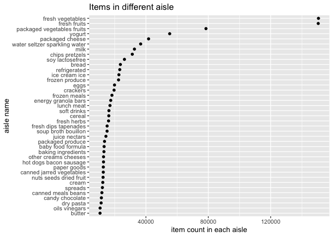
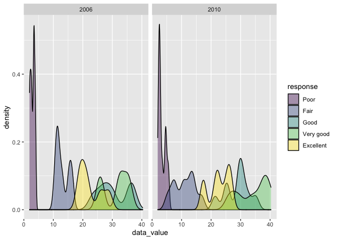
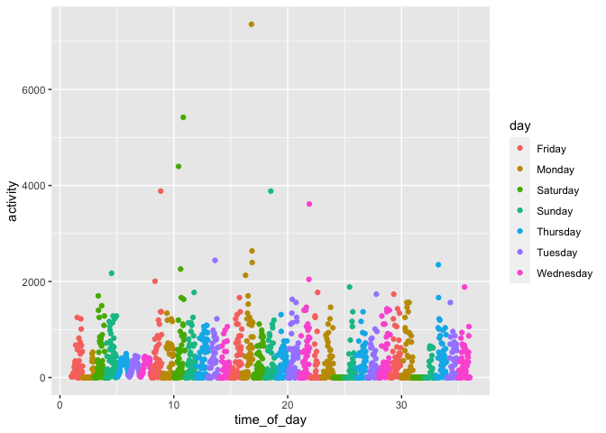
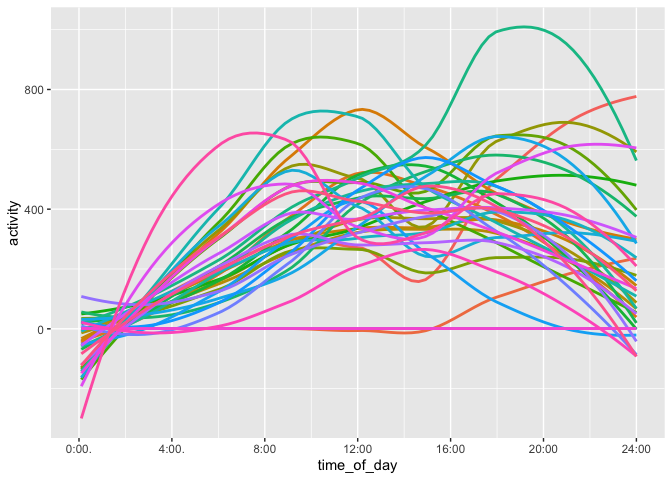
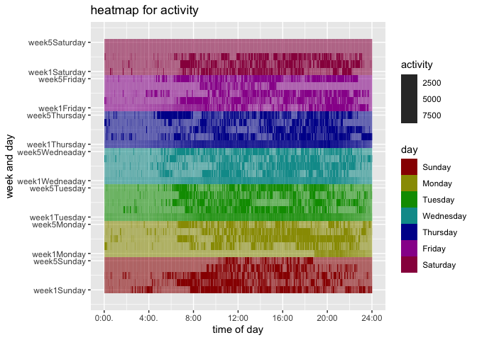

p8105\_hw3\_yl4925
================
Yiming Li
10/12/2021

# Problem 1

``` r
library(tidyverse)
```

    ## ── Attaching packages ─────────────────────────────────────── tidyverse 1.3.1 ──

    ## ✓ ggplot2 3.3.5     ✓ purrr   0.3.4
    ## ✓ tibble  3.1.4     ✓ dplyr   1.0.7
    ## ✓ tidyr   1.1.3     ✓ stringr 1.4.0
    ## ✓ readr   2.0.1     ✓ forcats 0.5.1

    ## ── Conflicts ────────────────────────────────────────── tidyverse_conflicts() ──
    ## x dplyr::filter() masks stats::filter()
    ## x dplyr::lag()    masks stats::lag()

``` r
library(p8105.datasets)
```

## Description for dataset

``` r
data("instacart")
instacart_row = nrow(instacart)
instacart_column = ncol(instacart)
```

``` r
# this is structure for instacart 
str(instacart)
```

    ## tibble [1,384,617 × 15] (S3: tbl_df/tbl/data.frame)
    ##  $ order_id              : int [1:1384617] 1 1 1 1 1 1 1 1 36 36 ...
    ##  $ product_id            : int [1:1384617] 49302 11109 10246 49683 43633 13176 47209 22035 39612 19660 ...
    ##  $ add_to_cart_order     : int [1:1384617] 1 2 3 4 5 6 7 8 1 2 ...
    ##  $ reordered             : int [1:1384617] 1 1 0 0 1 0 0 1 0 1 ...
    ##  $ user_id               : int [1:1384617] 112108 112108 112108 112108 112108 112108 112108 112108 79431 79431 ...
    ##  $ eval_set              : chr [1:1384617] "train" "train" "train" "train" ...
    ##  $ order_number          : int [1:1384617] 4 4 4 4 4 4 4 4 23 23 ...
    ##  $ order_dow             : int [1:1384617] 4 4 4 4 4 4 4 4 6 6 ...
    ##  $ order_hour_of_day     : int [1:1384617] 10 10 10 10 10 10 10 10 18 18 ...
    ##  $ days_since_prior_order: int [1:1384617] 9 9 9 9 9 9 9 9 30 30 ...
    ##  $ product_name          : chr [1:1384617] "Bulgarian Yogurt" "Organic 4% Milk Fat Whole Milk Cottage Cheese" "Organic Celery Hearts" "Cucumber Kirby" ...
    ##  $ aisle_id              : int [1:1384617] 120 108 83 83 95 24 24 21 2 115 ...
    ##  $ department_id         : int [1:1384617] 16 16 4 4 15 4 4 16 16 7 ...
    ##  $ aisle                 : chr [1:1384617] "yogurt" "other creams cheeses" "fresh vegetables" "fresh vegetables" ...
    ##  $ department            : chr [1:1384617] "dairy eggs" "dairy eggs" "produce" "produce" ...
    ##  - attr(*, "spec")=
    ##   .. cols(
    ##   ..   order_id = col_integer(),
    ##   ..   product_id = col_integer(),
    ##   ..   add_to_cart_order = col_integer(),
    ##   ..   reordered = col_integer(),
    ##   ..   user_id = col_integer(),
    ##   ..   eval_set = col_character(),
    ##   ..   order_number = col_integer(),
    ##   ..   order_dow = col_integer(),
    ##   ..   order_hour_of_day = col_integer(),
    ##   ..   days_since_prior_order = col_integer(),
    ##   ..   product_name = col_character(),
    ##   ..   aisle_id = col_integer(),
    ##   ..   department_id = col_integer(),
    ##   ..   aisle = col_character(),
    ##   ..   department = col_character()
    ##   .. )

Instacart is an online grocery service that allows you to shop online
from local stores.The size of this dataset is (1384617, 15). We find
that 4 out of 15 variables are character variable. They are eval\_set,
product\_name, aisle and department. The rest 11 variables are integer
variables. They are order\_id, product\_id, add\_to\_cart\_order,
reordered, user\_id. order\_number, order\_dow, order\_hour\_of\_day,
days\_since\_prior\_order, aisle\_id and department\_id.

All id variables represent specific identity.

Reordered variables indicates whether this product has been ordered by
this user in the past, with 1 is yes, 0 is no.

Order\_number indicates the order sequence of users with n represents
this is nth order for user.

Order\_dow, order\_hour\_of\_day and days\_since\_prior\_order indicate
time of making order and time interval since last order. For example,
order\_dow is 4 means order is made on fourth day of week.
Order\_hour\_of\_day is 10 means order is made on 10a.m.
Days\_since\_prior\_order is 30 means that last order is made 30 days
before.

The rest variables indicate products’ property.

``` r
instacart[1, ] %>% 
  knitr::kable()
```

| order\_id | product\_id | add\_to\_cart\_order | reordered | user\_id | eval\_set | order\_number | order\_dow | order\_hour\_of\_day | days\_since\_prior\_order | product\_name    | aisle\_id | department\_id | aisle  | department |
|----------:|------------:|---------------------:|----------:|---------:|:----------|--------------:|-----------:|---------------------:|--------------------------:|:-----------------|----------:|---------------:|:-------|:-----------|
|         1 |       49302 |                    1 |         1 |   112108 | train     |             4 |          4 |                   10 |                         9 | Bulgarian Yogurt |       120 |             16 | yogurt | dairy eggs |

For example, this is the data of the first row. It tells us that a users
placed this order on the fourth day of week at 10:00 a.m.. It has been 9
days since his/her last order. This time he/she ordered Bulgarian Yogurt
from Yogurt aisle, dairy eggs department.

## How many aisles are there, and which aisles are the most items ordered from?

``` r
aisle = group_by(instacart, aisle) %>% 
  summarise(n_item = n()) %>% 
  arrange(-n_item)
aisle_row = nrow(aisle)
aisle_most = aisle$aisle[1]
```

There are totally 134 aisles, and fresh vegetables is aisle which the
most items ordered from.

## Plot for items in aisle

Make a plot that shows the number of items vs aisle with more than 10000
items ordered.

``` r
aisle %>% 
  filter(n_item > 10000 ) %>%
  ggplot(aes(x = n_item, y = reorder(aisle, n_item))) + 
  labs(
    title = "Items in different aisle",
    x = "item count in each aisle",
    y = "aisle name"
  ) + geom_point() 
```

<!-- --> We
can see for aisle with more than 10000 items, butter has the least items
and fresh vegetables has the most items. And there are far more resh
fruits and vegetables than others.

## Table for three popular prodcut in three specific aisle

Three most popular items in “baking ingredients”, “dog food care”, and
packaged vegetable fruits".

``` r
three_pop = instacart %>% 
  filter(aisle == "baking ingredients" | aisle == "dog food care" | 
           aisle == "packaged vegetables fruits") %>% 
  group_by(aisle, product_name) %>% 
  summarise(count = n()) %>% 
  arrange(-count) %>% 
  filter(aisle == "baking ingredients" | aisle == "dog food care" | 
           aisle == "packaged vegetables fruits", 1:n() <= 3)
```

    ## `summarise()` has grouped output by 'aisle'. You can override using the `.groups` argument.

``` r
knitr::kable(three_pop)
```

| aisle                      | product\_name                                 | count |
|:---------------------------|:----------------------------------------------|------:|
| packaged vegetables fruits | Organic Baby Spinach                          |  9784 |
| packaged vegetables fruits | Organic Raspberries                           |  5546 |
| packaged vegetables fruits | Organic Blueberries                           |  4966 |
| baking ingredients         | Light Brown Sugar                             |   499 |
| baking ingredients         | Pure Baking Soda                              |   387 |
| baking ingredients         | Cane Sugar                                    |   336 |
| dog food care              | Snack Sticks Chicken & Rice Recipe Dog Treats |    30 |
| dog food care              | Organix Chicken & Brown Rice Recipe           |    28 |
| dog food care              | Small Dog Biscuits                            |    26 |

We find that three most popular items are organic baby spinach, organic
raspberries and organic blueberries in packaged vegetables fruits; light
brown sugar, pure baking soda and cane sugar in baking ingredients;
snack stick chicken & rice recipe dog treats, organix chicken &brown
rice recipe and small dog biscuits in dog food care.

## Table for Mean hour of the day at which Pink Lady Apples and Coffee Ice Cream are ordered on each day of the week

``` r
mean_Apple_Icecream = instacart %>% 
  filter(product_name == "Pink Lady Apples" | product_name == "Coffee Ice Cream") %>% 
  group_by(product_name, order_dow) %>% 
  summarise(mean = mean(order_hour_of_day)) %>% 
  pivot_wider(
    names_from = order_dow,
    values_from = mean
  ) 
```

    ## `summarise()` has grouped output by 'product_name'. You can override using the `.groups` argument.

``` r
knitr::kable(mean_Apple_Icecream)
```

| product\_name    |        0 |        1 |        2 |        3 |        4 |        5 |        6 |
|:-----------------|---------:|---------:|---------:|---------:|---------:|---------:|---------:|
| Coffee Ice Cream | 13.77419 | 14.31579 | 15.38095 | 15.31818 | 15.21739 | 12.26316 | 13.83333 |
| Pink Lady Apples | 13.44118 | 11.36000 | 11.70213 | 14.25000 | 11.55172 | 12.78431 | 11.93750 |

We find the mean order time of coffee ice cream is higher than mean
order time of pink lady apple during six days out a week.

(note: there is no extra description for order\_dow variable, I mean we
could not know “order\_dow = 0” is whether Monday or Sunday. So I did
not change the variable names and kept original names.)

# Problem 2

Load data

``` r
library(p8105.datasets)
data("brfss_smart2010")
```

## Clean the data

I do the data cleaning in this chunk and mainly focus on Overall Health
topic. And also factor response variable from poor to excellent.

``` r
brfss_clean = brfss_smart2010 %>% 
  janitor::clean_names() %>% 
  filter(topic == "Overall Health",
         response %in% c("Poor", "Fair", "Good", "Very good", "Excellent")) %>% 
  mutate(response = factor(response, 
                           levels = c("Poor", "Fair", "Good", "Very good", "Excellent"), 
                           ordered = TRUE)) %>% 
  arrange(response)

brfss_clean
```

    ## # A tibble: 10,625 × 23
    ##     year locationabbr locationdesc  class  topic  question  response sample_size
    ##    <int> <chr>        <chr>         <chr>  <chr>  <chr>     <ord>          <int>
    ##  1  2010 AL           AL - Jeffers… Healt… Overa… How is y… Poor              45
    ##  2  2010 AL           AL - Mobile … Healt… Overa… How is y… Poor              66
    ##  3  2010 AL           AL - Tuscalo… Healt… Overa… How is y… Poor              35
    ##  4  2010 AZ           AZ - Maricop… Healt… Overa… How is y… Poor              62
    ##  5  2010 AZ           AZ - Pima Co… Healt… Overa… How is y… Poor              49
    ##  6  2010 AZ           AZ - Pinal C… Healt… Overa… How is y… Poor              30
    ##  7  2010 AR           AR - Benton … Healt… Overa… How is y… Poor              21
    ##  8  2010 AR           AR - Pulaski… Healt… Overa… How is y… Poor              36
    ##  9  2010 AR           AR - Washing… Healt… Overa… How is y… Poor              16
    ## 10  2010 CA           CA - Alameda… Healt… Overa… How is y… Poor              23
    ## # … with 10,615 more rows, and 15 more variables: data_value <dbl>,
    ## #   confidence_limit_low <dbl>, confidence_limit_high <dbl>,
    ## #   display_order <int>, data_value_unit <chr>, data_value_type <chr>,
    ## #   data_value_footnote_symbol <chr>, data_value_footnote <chr>,
    ## #   data_source <chr>, class_id <chr>, topic_id <chr>, location_id <chr>,
    ## #   question_id <chr>, respid <chr>, geo_location <chr>

## State with 7 & more observation in 2002/2010

``` r
distinct_brfss_clean = brfss_clean[!duplicated(brfss_clean[,1:3]),]
greater7_obs_in02or10 = distinct_brfss_clean %>% 
  filter(year == 2010 | year == 2002) %>% 
  group_by(locationabbr, year) %>% 
  summarise(n_loca = n()) %>% 
  filter(n_loca >= 7) %>% 
  pivot_wider(
    names_from = locationabbr,
    values_from = n_loca
  )
```

    ## `summarise()` has grouped output by 'locationabbr'. You can override using the `.groups` argument.

``` r
knitr::kable(greater7_obs_in02or10)
```

| year |  CA |  CO |  CT |  FL |  MA |  MD |  NC |  NE |  NJ |  NY |  OH |  PA |  SC |  TX |  WA |
|-----:|----:|----:|----:|----:|----:|----:|----:|----:|----:|----:|----:|----:|----:|----:|----:|
| 2010 |  12 |   7 |  NA |  41 |   9 |  12 |  12 |  10 |  19 |   9 |   8 |   7 |   7 |  16 |  10 |
| 2002 |  NA |  NA |   7 |   7 |   8 |  NA |   7 |  NA |   8 |  NA |  NA |  10 |  NA |  NA |  NA |

No less than 7 observed in 2002 and 2010. We need to notice that one
location of a state could have at most five responses, so we should
delete the duplicated one, that is, we should count the distinct
locationdesc regardless of responses. There are 14 states had 7 & more
observations in 2010, while there are only 6 states had 7 & more
observations in 2002.

## Plot for state mean data\_value vs year among those excellent resopnse

``` r
excellent_resp = brfss_clean %>% 
  filter(response == "Excellent") %>% 
  group_by(year, locationabbr) %>% 
  summarise(state_mean = mean(data_value))
```

    ## `summarise()` has grouped output by 'year'. You can override using the `.groups` argument.

``` r
excellent_resp 
```

    ## # A tibble: 443 × 3
    ## # Groups:   year [9]
    ##     year locationabbr state_mean
    ##    <int> <chr>             <dbl>
    ##  1  2002 AK                 27.9
    ##  2  2002 AL                 18.5
    ##  3  2002 AR                 24.1
    ##  4  2002 AZ                 24.1
    ##  5  2002 CA                 22.7
    ##  6  2002 CO                 23.1
    ##  7  2002 CT                 29.1
    ##  8  2002 DC                 29.3
    ##  9  2002 DE                 20.9
    ## 10  2002 FL                 25.7
    ## # … with 433 more rows

``` r
ggplot(excellent_resp, aes(x = year, y = state_mean, color = locationabbr)) + 
  labs(
    title = "State mean over year"
  ) + 
  geom_line(aes(group = locationabbr))
```

    ## Warning: Removed 3 row(s) containing missing values (geom_path).

<!-- -->
This is a little bit messy because there are too much line in this plot.

## Two-panel plot for different responses’ data value distribution in 2006-NY and 2010-NY

``` r
brfss_clean %>% 
  filter(year == 2006 | year == 2010, 
         locationabbr == "NY") %>% 
  ggplot(aes(x = data_value, fill = response)) +
  geom_density(alpha = .4, adjust = .5, color = "black") +
  labs(
    x = "data_value"
  ) + 
  facet_grid(.~year)
```

<!-- --> I
mainly use density line to show the distribution, and draw 5
distribution according to responses. Since data value in a specific
response has similar value, so I use adjust = .5 to make density more
sharp.

# Problem 3

## Description and load

Load data(including dataset in local data directory)

``` r
accel_df = read_csv("./data/accel_data.csv") %>% 
  janitor::clean_names() %>% 
  mutate(weekday_vs_weekend = case_when(
    day == "Monday"  ~ "Weekday",
    day == "Tuesday"  ~ "Weekday",
    day == "Wednesday"  ~ "Weekday",
    day == "Thursday"  ~ "Weekday",
    day == "Friday"  ~ "Weekday",
    day == "Sunday"  ~ "Weekend",
    day == "Saturday"  ~ "Weekend"
  )) %>% 
  select(week, day_id, day, weekday_vs_weekend, everything())
```

    ## Rows: 35 Columns: 1443

    ## ── Column specification ────────────────────────────────────────────────────────
    ## Delimiter: ","
    ## chr    (1): day
    ## dbl (1442): week, day_id, activity.1, activity.2, activity.3, activity.4, ac...

    ## 
    ## ℹ Use `spec()` to retrieve the full column specification for this data.
    ## ℹ Specify the column types or set `show_col_types = FALSE` to quiet this message.

``` r
accel_df
```

    ## # A tibble: 35 × 1,444
    ##     week day_id day       weekday_vs_weekend activity_1 activity_2 activity_3
    ##    <dbl>  <dbl> <chr>     <chr>                   <dbl>      <dbl>      <dbl>
    ##  1     1      1 Friday    Weekday                  88.4       82.2       64.4
    ##  2     1      2 Monday    Weekday                   1          1          1  
    ##  3     1      3 Saturday  Weekend                   1          1          1  
    ##  4     1      4 Sunday    Weekend                   1          1          1  
    ##  5     1      5 Thursday  Weekday                  47.4       48.8       46.9
    ##  6     1      6 Tuesday   Weekday                  64.8       59.5       73.7
    ##  7     1      7 Wednesday Weekday                  71.1      103.        68.5
    ##  8     2      8 Friday    Weekday                 675        542       1010  
    ##  9     2      9 Monday    Weekday                 291        335        393  
    ## 10     2     10 Saturday  Weekend                  64         11          1  
    ## # … with 25 more rows, and 1,437 more variables: activity_4 <dbl>,
    ## #   activity_5 <dbl>, activity_6 <dbl>, activity_7 <dbl>, activity_8 <dbl>,
    ## #   activity_9 <dbl>, activity_10 <dbl>, activity_11 <dbl>, activity_12 <dbl>,
    ## #   activity_13 <dbl>, activity_14 <dbl>, activity_15 <dbl>, activity_16 <dbl>,
    ## #   activity_17 <dbl>, activity_18 <dbl>, activity_19 <dbl>, activity_20 <dbl>,
    ## #   activity_21 <dbl>, activity_22 <dbl>, activity_23 <dbl>, activity_24 <dbl>,
    ## #   activity_25 <dbl>, activity_26 <dbl>, activity_27 <dbl>, …

The size of this tidied dataset is (35, 1444). It includes a new
character variable indicating whether it is weekday or weekend. Besides
this variavble, this dataset has three time-reflected variables:
week(week number), day\_id(day number), day(Sunday to Saturday), and
1440 activity\_k variables indicating the activity count of
*k*<sub>*t**h*</sub> minute during a day. And this dataframe contains
records of 5 weeks(total 35 days).

## Total activity of day

``` r
accel_df %>% 
  mutate(total_act = rowSums(accel_df[,c(-1, -2, -3, -4)])) %>% 
  select(week, day_id, day, weekday_vs_weekend, total_act) %>% 
  knitr::kable()
```

| week | day\_id | day       | weekday\_vs\_weekend | total\_act |
|-----:|--------:|:----------|:---------------------|-----------:|
|    1 |       1 | Friday    | Weekday              |  480542.62 |
|    1 |       2 | Monday    | Weekday              |   78828.07 |
|    1 |       3 | Saturday  | Weekend              |  376254.00 |
|    1 |       4 | Sunday    | Weekend              |  631105.00 |
|    1 |       5 | Thursday  | Weekday              |  355923.64 |
|    1 |       6 | Tuesday   | Weekday              |  307094.24 |
|    1 |       7 | Wednesday | Weekday              |  340115.01 |
|    2 |       8 | Friday    | Weekday              |  568839.00 |
|    2 |       9 | Monday    | Weekday              |  295431.00 |
|    2 |      10 | Saturday  | Weekend              |  607175.00 |
|    2 |      11 | Sunday    | Weekend              |  422018.00 |
|    2 |      12 | Thursday  | Weekday              |  474048.00 |
|    2 |      13 | Tuesday   | Weekday              |  423245.00 |
|    2 |      14 | Wednesday | Weekday              |  440962.00 |
|    3 |      15 | Friday    | Weekday              |  467420.00 |
|    3 |      16 | Monday    | Weekday              |  685910.00 |
|    3 |      17 | Saturday  | Weekend              |  382928.00 |
|    3 |      18 | Sunday    | Weekend              |  467052.00 |
|    3 |      19 | Thursday  | Weekday              |  371230.00 |
|    3 |      20 | Tuesday   | Weekday              |  381507.00 |
|    3 |      21 | Wednesday | Weekday              |  468869.00 |
|    4 |      22 | Friday    | Weekday              |  154049.00 |
|    4 |      23 | Monday    | Weekday              |  409450.00 |
|    4 |      24 | Saturday  | Weekend              |    1440.00 |
|    4 |      25 | Sunday    | Weekend              |  260617.00 |
|    4 |      26 | Thursday  | Weekday              |  340291.00 |
|    4 |      27 | Tuesday   | Weekday              |  319568.00 |
|    4 |      28 | Wednesday | Weekday              |  434460.00 |
|    5 |      29 | Friday    | Weekday              |  620860.00 |
|    5 |      30 | Monday    | Weekday              |  389080.00 |
|    5 |      31 | Saturday  | Weekend              |    1440.00 |
|    5 |      32 | Sunday    | Weekend              |  138421.00 |
|    5 |      33 | Thursday  | Weekday              |  549658.00 |
|    5 |      34 | Tuesday   | Weekday              |  367824.00 |
|    5 |      35 | Wednesday | Weekday              |  445366.00 |

We found that there were two total activities for Saturday equal to
1440, which might mean there was something wrong with accelerometers
record or this man did not move heavily on these two days. We could not
see the apparent trends.

Total activities over day

``` r
Total_act_df = accel_df %>% 
  mutate(total_act = rowSums(accel_df[,c(-1, -2, -3, -4)])) %>% 
  select(week, day_id, day, weekday_vs_weekend, total_act) 

Total_act_df %>% 
  arrange(total_act)
```

    ## # A tibble: 35 × 5
    ##     week day_id day       weekday_vs_weekend total_act
    ##    <dbl>  <dbl> <chr>     <chr>                  <dbl>
    ##  1     4     24 Saturday  Weekend                1440 
    ##  2     5     31 Saturday  Weekend                1440 
    ##  3     1      2 Monday    Weekday               78828.
    ##  4     5     32 Sunday    Weekend              138421 
    ##  5     4     22 Friday    Weekday              154049 
    ##  6     4     25 Sunday    Weekend              260617 
    ##  7     2      9 Monday    Weekday              295431 
    ##  8     1      6 Tuesday   Weekday              307094.
    ##  9     4     27 Tuesday   Weekday              319568 
    ## 10     1      7 Wednesday Weekday              340115.
    ## # … with 25 more rows

``` r
Total_act_df %>% 
ggplot(aes(x = day_id, y = total_act, color = day)) + geom_point() + geom_line()
```

<!-- -->
Actually we cannot easily see the trends from data table, so I make a
plot. However, it is so messy to find exact trend even with plot. So
there might be no apparent trends based on my current data and plot.

## Plot for day activity analysis

Draw a plot to show the 24-hour activity time courses for each day with
color indicating day of the week.

``` r
accel_plot_df = accel_df %>% 
  select(-weekday_vs_weekend) %>% 
  pivot_longer(
    activity_1:activity_1440,
    names_to = "activity_number",
    values_to = "activity"
  ) %>% 
  separate(activity_number, into = c("prefix", "time_of_day"), sep = "_") %>% 
  select(-prefix) %>% 
  mutate(time_of_day = as.numeric(time_of_day)) 

accel_plot_df %>% 
  ggplot(aes(x = time_of_day, y = activity, color = day)) + 
  geom_point()
```

<!-- -->
There are too much overlap, so I will change the x axis .

``` r
accel_plot_df %>% 
  mutate(time_of_day = day_id + time_of_day/1440) %>% 
  ggplot(aes(x = time_of_day, y = activity, color = day)) + 
  geom_point()
```

<!-- --> If
we use scatter plot, we might find activity will increase firstly and
decrease then. There is so many record in each day, so we can only find
the shape for each day is just like a mountain. So I will try to sample
some daily records on specific time of each day and see whether there
are trends.

``` r
accel_plot_df %>% 
  filter(time_of_day %% 24 == 0) %>% 
  mutate(time_of_day = day_id + time_of_day/1440) %>% 
  ggplot(aes(x = time_of_day, y = activity, color = day)) + 
  geom_point()
```

<!-- --> It
looks better, but still messy. I will try to omit actual
time\_of\_day(“day\_id + time\_of\_day/1440” in my code), and combine
all data from each day of week together.(that is 35 line from beginning
of a day to end of a day)

``` r
accel_plot_df %>% 
  mutate(week  = recode(week, '1' = "week1", '2' = "week2", '3' = "week3", 
                        '4' = "week4", '5' = "week5"),
         week_day = paste(week, day, sep = "_")) %>% 
  filter(time_of_day %% 6 == 0) %>% 
  ggplot(aes(x = time_of_day, y = activity, color = week_day)) + 
  theme(legend.position = "none") +
  geom_smooth(se = FALSE) + 
  scale_x_continuous(
    breaks = c(0, 240, 480, 720, 960, 1200, 1440), 
    labels = c("0:00.", "4:00.","8:00", "12:00", "16:00", "20:00", "24:00"),
    limits = c(-1, 1441))
```

    ## `geom_smooth()` using method = 'loess' and formula 'y ~ x'

<!-- -->

``` r
accel_plot_df %>% 
  mutate(week  = recode(week, '1' = "week1", '2' = "week2", '3' = "week3", 
                        '4' = "week4", '5' = "week5"),
         week_day = paste(week, day, sep = "_")) %>% 
  filter(time_of_day %% 6 == 0, week_day == "week1_Wednesday") 
```

    ## # A tibble: 240 × 6
    ##    week  day_id day       time_of_day activity week_day       
    ##    <chr>  <dbl> <chr>           <dbl>    <dbl> <chr>          
    ##  1 week1      7 Wednesday           6    18.3  week1_Wednesday
    ##  2 week1      7 Wednesday          12    80.0  week1_Wednesday
    ##  3 week1      7 Wednesday          18    19.6  week1_Wednesday
    ##  4 week1      7 Wednesday          24    21.8  week1_Wednesday
    ##  5 week1      7 Wednesday          30    26.5  week1_Wednesday
    ##  6 week1      7 Wednesday          36    10.4  week1_Wednesday
    ##  7 week1      7 Wednesday          42    10.3  week1_Wednesday
    ##  8 week1      7 Wednesday          48    60.5  week1_Wednesday
    ##  9 week1      7 Wednesday          54     5.62 week1_Wednesday
    ## 10 week1      7 Wednesday          60    19.9  week1_Wednesday
    ## # … with 230 more rows

We can see there is an activity “peak” for most of 35 days, and “peak”
is in time intervel \[8:00, 20:00\]. But this is still confused because
there are 35 lines, so I will try to use heatmap to show its trends more
accurately.

``` r
heatmap_df = accel_df %>% 
  mutate(day = factor(day, levels = c("Sunday", "Monday", "Tuesday", "Wednesday", 
                                      "Thursday", "Friday", "Saturday"), ordered = TRUE)) %>% 
  arrange(day) %>% 
  mutate(modified_day_id = 1:35) %>% 
  select(-weekday_vs_weekend) %>% 
  pivot_longer(
    activity_1:activity_1440,
    names_to = "activity_number",
    values_to = "activity"
  ) %>% 
  separate(activity_number, into = c("prefix", "time_of_day"), sep = "_") %>% 
  select(-prefix) %>% 
  mutate(time_of_day = as.numeric(time_of_day))

heatmap_df %>% 
  ggplot(aes(x = time_of_day, y = modified_day_id, fill = day, alpha = activity)) +
  geom_tile() +
  labs(
    title = "heatmap for activity",
    x = "time of day",
    y = "week and day"
  ) + 
  scale_fill_manual(values = c("#990000", "#999900", "#009900", "#009999",
                               "#000099", "#990099", "#99004C")) +
  scale_x_continuous(
    breaks = c(0, 240, 480, 720, 960, 1200, 1440), 
    labels = c("0:00.", "4:00.","8:00", "12:00", "16:00", "20:00", "24:00"),
    limits = c(-1, 1441)) +
  scale_y_continuous(
    breaks = c(1, 5, 6, 10, 11, 15, 16, 20, 21, 25, 26, 30, 31, 35), 
    labels = c("week1Sunday", "week5Sunday",
               "week1Monday", "week5Monday",
               "week1Tuesday", "week5Tuesday",
               "week1Wedneaday", "week5Wedneaday",
               "week1Thursday", "week5Thursday",
               "week1Friday", "week5Friday",
               "week1Saturday", "week5Saturday"),
    limits = c(0, 36)) +
  scale_alpha(range = c(0.4, 10)) 
```

<!-- -->

Through heatmap we can see that in time interval \[8:00, 20:00\], it has
deeper color than the rest time of a day. Since we have use alpha to
represent activity, we can say in time interval \[8:00, 20:00\], this
man’s activity is higher than the rest time of a day.(greater activity
value means greater alpha, thus deeper color). This time interval is
also reasonable because 8:00 is close to time when we usually get up,
and 20:00 is close to time when we prepare to rest at home.
