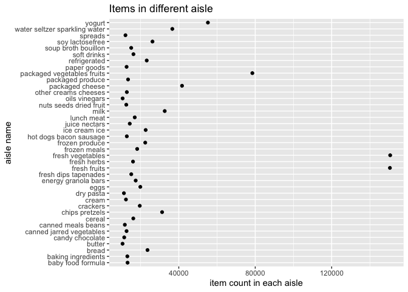
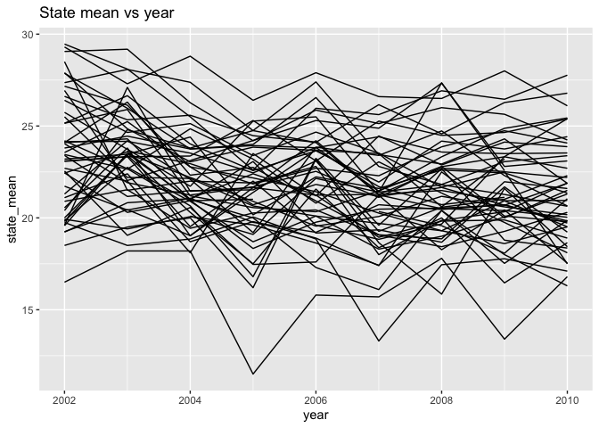
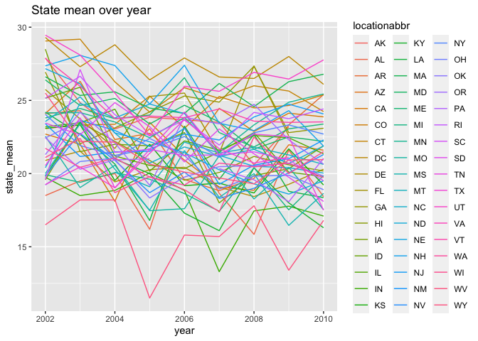
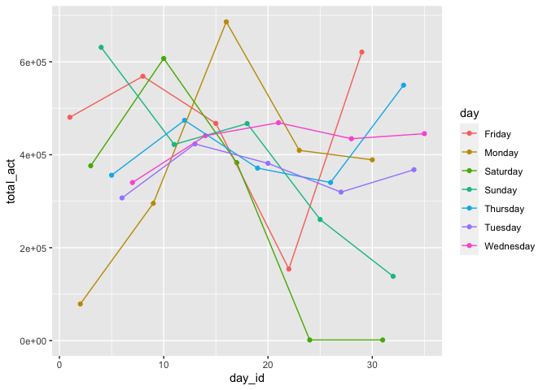
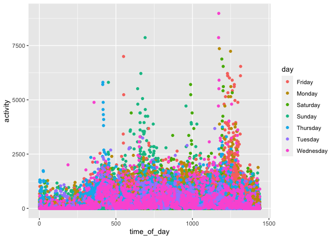
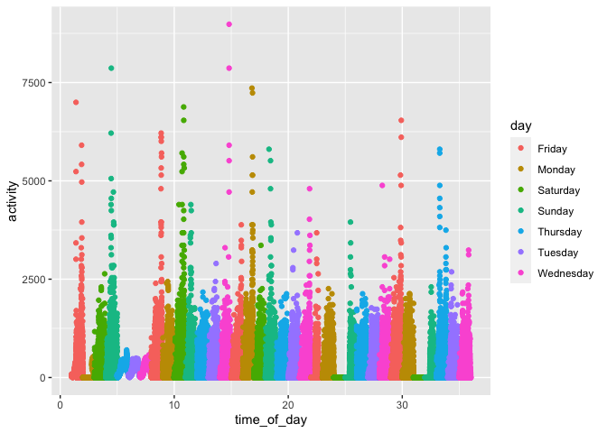
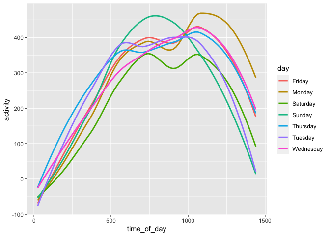

p8105\_hw3\_yl4925
================
Yiming Li
10/12/2021

## Problem 1

``` r
library(tidyverse)
```

    ## ── Attaching packages ─────────────────────────────────────── tidyverse 1.3.1 ──

    ## ✓ ggplot2 3.3.5     ✓ purrr   0.3.4
    ## ✓ tibble  3.1.4     ✓ dplyr   1.0.7
    ## ✓ tidyr   1.1.3     ✓ stringr 1.4.0
    ## ✓ readr   2.0.1     ✓ forcats 0.5.1

    ## ── Conflicts ────────────────────────────────────────── tidyverse_conflicts() ──
    ## x dplyr::filter() masks stats::filter()
    ## x dplyr::lag()    masks stats::lag()

``` r
library(p8105.datasets)
library(patchwork)
```

``` r
data("instacart")
instacart_row = nrow(instacart)
instacart_column = ncol(instacart)
```

``` r
# this is structure for instacart 
str(instacart)
```

    ## tibble [1,384,617 × 15] (S3: tbl_df/tbl/data.frame)
    ##  $ order_id              : int [1:1384617] 1 1 1 1 1 1 1 1 36 36 ...
    ##  $ product_id            : int [1:1384617] 49302 11109 10246 49683 43633 13176 47209 22035 39612 19660 ...
    ##  $ add_to_cart_order     : int [1:1384617] 1 2 3 4 5 6 7 8 1 2 ...
    ##  $ reordered             : int [1:1384617] 1 1 0 0 1 0 0 1 0 1 ...
    ##  $ user_id               : int [1:1384617] 112108 112108 112108 112108 112108 112108 112108 112108 79431 79431 ...
    ##  $ eval_set              : chr [1:1384617] "train" "train" "train" "train" ...
    ##  $ order_number          : int [1:1384617] 4 4 4 4 4 4 4 4 23 23 ...
    ##  $ order_dow             : int [1:1384617] 4 4 4 4 4 4 4 4 6 6 ...
    ##  $ order_hour_of_day     : int [1:1384617] 10 10 10 10 10 10 10 10 18 18 ...
    ##  $ days_since_prior_order: int [1:1384617] 9 9 9 9 9 9 9 9 30 30 ...
    ##  $ product_name          : chr [1:1384617] "Bulgarian Yogurt" "Organic 4% Milk Fat Whole Milk Cottage Cheese" "Organic Celery Hearts" "Cucumber Kirby" ...
    ##  $ aisle_id              : int [1:1384617] 120 108 83 83 95 24 24 21 2 115 ...
    ##  $ department_id         : int [1:1384617] 16 16 4 4 15 4 4 16 16 7 ...
    ##  $ aisle                 : chr [1:1384617] "yogurt" "other creams cheeses" "fresh vegetables" "fresh vegetables" ...
    ##  $ department            : chr [1:1384617] "dairy eggs" "dairy eggs" "produce" "produce" ...
    ##  - attr(*, "spec")=
    ##   .. cols(
    ##   ..   order_id = col_integer(),
    ##   ..   product_id = col_integer(),
    ##   ..   add_to_cart_order = col_integer(),
    ##   ..   reordered = col_integer(),
    ##   ..   user_id = col_integer(),
    ##   ..   eval_set = col_character(),
    ##   ..   order_number = col_integer(),
    ##   ..   order_dow = col_integer(),
    ##   ..   order_hour_of_day = col_integer(),
    ##   ..   days_since_prior_order = col_integer(),
    ##   ..   product_name = col_character(),
    ##   ..   aisle_id = col_integer(),
    ##   ..   department_id = col_integer(),
    ##   ..   aisle = col_character(),
    ##   ..   department = col_character()
    ##   .. )

Instacart is an online grocery service that allows you to shop online
from local stores.The size of this dataset is (1384617, 15). We find
that 4 out of 15 variables are character variable. They are eval\_set,
product\_name, aisle and department. The rest 11 variables are integer
variables. They are order\_id, product\_id, add\_to\_cart\_order,
reordered, user\_id. order\_number, order\_dow, order\_hour\_of\_day,
days\_since\_prior\_order, aisle\_id and department\_id. All id
variables represent specific accounts and items.

Reordered variables indicates whether this product has been ordered by
this user in the past, with 1 is yes, 0 is no.

Order\_number indicates the order sequence of users with n represents
this is nth order for user.

Order\_dow, order\_hour\_of\_day and days\_since\_prior\_order indicate
time of making order and time interval from last order. For example,
order\_dow is 4 means order is made on Thursday. Order\_hour\_of\_day is
10 means order is made on 10a.m. Days\_since\_prior\_order is 30 means
that last order is made 30 days before.

The rest variables indicate products’ property.

``` r
aisle = group_by(instacart, aisle) %>% 
  summarise(nobs = n()) %>% 
  arrange(-nobs)
aisle_row = nrow(aisle)
aisle_most = aisle$aisle[1]
```

There are totally 134 aisles, and fresh vegetables is aisle which the
most items ordered from.

Make a plot that shows the number of items vs aisle with more than 10000
items ordered.

``` r
aisle %>% 
  filter(nobs > 10000 ) %>%
  ggplot(aes(x = nobs, y = aisle)) + 
  labs(
    title = "Items in different aisle",
    x = "item count in each aisle",
    y = "aisle name"
  ) + geom_point() 
```

<!-- -->

Three most popular items in “baking ingredients”, “dog food care”, and
packaged vegetable fruits".

``` r
instacart %>% 
  filter(aisle == "baking ingredients") %>% 
  group_by(product_name) %>% 
  summarise(count = n()) %>% 
  arrange(-count) %>% 
  filter(1:n() <= 3)
```

    ## # A tibble: 3 × 2
    ##   product_name      count
    ##   <chr>             <int>
    ## 1 Light Brown Sugar   499
    ## 2 Pure Baking Soda    387
    ## 3 Cane Sugar          336

``` r
instacart %>% 
  filter(aisle == "dog food care") %>% 
  group_by(product_name) %>% 
  summarise(count = n()) %>% 
  arrange(-count) %>% 
  filter(1:n() <= 3)
```

    ## # A tibble: 3 × 2
    ##   product_name                                  count
    ##   <chr>                                         <int>
    ## 1 Snack Sticks Chicken & Rice Recipe Dog Treats    30
    ## 2 Organix Chicken & Brown Rice Recipe              28
    ## 3 Small Dog Biscuits                               26

``` r
instacart %>% 
  filter(aisle == "packaged vegetables fruits") %>% 
  group_by(product_name) %>% 
  summarise(count = n()) %>% 
  arrange(-count) %>% 
  filter(1:n() <= 3)
```

    ## # A tibble: 3 × 2
    ##   product_name         count
    ##   <chr>                <int>
    ## 1 Organic Baby Spinach  9784
    ## 2 Organic Raspberries   5546
    ## 3 Organic Blueberries   4966

Mean hour of the day at which Pink Lady Apples and Coffee Ice Cream are
ordered on each day of the week

``` r
instacart %>% 
  filter(product_name == "Pink Lady Apples" | product_name == "Coffee Ice Cream") %>% 
  group_by(product_name, order_dow) %>% 
  summarise(mean = mean(order_hour_of_day)) %>% 
  pivot_wider(
    names_from = order_dow,
    values_from = mean
  ) 
```

    ## `summarise()` has grouped output by 'product_name'. You can override using the `.groups` argument.

    ## # A tibble: 2 × 8
    ## # Groups:   product_name [2]
    ##   product_name       `0`   `1`   `2`   `3`   `4`   `5`   `6`
    ##   <chr>            <dbl> <dbl> <dbl> <dbl> <dbl> <dbl> <dbl>
    ## 1 Coffee Ice Cream  13.8  14.3  15.4  15.3  15.2  12.3  13.8
    ## 2 Pink Lady Apples  13.4  11.4  11.7  14.2  11.6  12.8  11.9

## Problem 2

Load data

``` r
library(p8105.datasets)
data("brfss_smart2010")
```

I do the data cleaning in this chunk and mainly focus on Overall Health
topic. And also factor response variable from poor to excellent.

``` r
brfss_clean = brfss_smart2010 %>% 
  janitor::clean_names() %>% 
  filter(topic == "Overall Health") %>% 
  mutate(response = factor(response, 
                           levels = c("Poor", "Fair", "Good", "Very good", "Excellent"), 
                           ordered = TRUE)) %>% 
  arrange(response)
```

No less than 7 observed in 2002 and 2010

``` r
brfss_clean %>% 
  filter(year == 2002 | year == 2010) %>% 
  group_by(locationabbr, year) %>% 
  summarise(n_loca = n()) %>% 
  filter(n_loca >= 7) %>% 
  pivot_wider(
    names_from = year,
    values_from = n_loca
  )
```

    ## `summarise()` has grouped output by 'locationabbr'. You can override using the `.groups` argument.

    ## # A tibble: 45 × 3
    ## # Groups:   locationabbr [45]
    ##    locationabbr `2010` `2002`
    ##    <chr>         <int>  <int>
    ##  1 AL               15     NA
    ##  2 AR               15     NA
    ##  3 AZ               15     10
    ##  4 CA               60     NA
    ##  5 CO               35     20
    ##  6 CT               25     35
    ##  7 DE               15     15
    ##  8 FL              205     35
    ##  9 GA               20     15
    ## 10 HI               20     20
    ## # … with 35 more rows

Within excellent response, draw a plot of state mean data\_value vs year

``` r
excellent_resp = brfss_clean %>% 
  filter(response == "Excellent") %>% 
  group_by(year, locationabbr) %>% 
  summarise(state_mean = mean(data_value))
```

    ## `summarise()` has grouped output by 'year'. You can override using the `.groups` argument.

``` r
excellent_resp 
```

    ## # A tibble: 443 × 3
    ## # Groups:   year [9]
    ##     year locationabbr state_mean
    ##    <int> <chr>             <dbl>
    ##  1  2002 AK                 27.9
    ##  2  2002 AL                 18.5
    ##  3  2002 AR                 24.1
    ##  4  2002 AZ                 24.1
    ##  5  2002 CA                 22.7
    ##  6  2002 CO                 23.1
    ##  7  2002 CT                 29.1
    ##  8  2002 DC                 29.3
    ##  9  2002 DE                 20.9
    ## 10  2002 FL                 25.7
    ## # … with 433 more rows

``` r
ggplot(excellent_resp, aes(x = year, y = state_mean)) + 
  labs(
    title = "State mean vs year"
  ) + 
  geom_line(aes(group = locationabbr))
```

    ## Warning: Removed 3 row(s) containing missing values (geom_path).

<!-- -->

Two-panel plot for different responses’ data value distribution in
2006-NY and 2010-NY

``` r
NY_2006 = brfss_clean %>% 
  filter(year == 2006) %>% 
  ggplot(aes(x = data_value, fill = response)) +
  geom_density(alpha = .4, adjust = .5, color = "black") +
  theme(legend.position = "none")

NY_2010 = brfss_clean %>% 
  filter(year == 2010) %>% 
  ggplot(aes(x = data_value, fill = response)) +
  geom_density(alpha = .4, adjust = .5, color = "black")

NY_2006 + NY_2010
```

    ## Warning: Removed 4 rows containing non-finite values (stat_density).

    ## Warning: Removed 5 rows containing non-finite values (stat_density).

<!-- -->

## Problem 3

Load data(including dataset in local data directory)

``` r
accel_df = read_csv("./data/accel_data.csv") %>% 
  janitor::clean_names() %>% 
  mutate(weekday_vs_weekend = case_when(
    day == "Monday"  ~ "Weekday",
    day == "Tuesday"  ~ "Weekday",
    day == "Wednesday"  ~ "Weekday",
    day == "Thursday"  ~ "Weekday",
    day == "Friday"  ~ "Weekday",
    day == "Sunday"  ~ "Weekend",
    day == "Saturday"  ~ "Weekend"
  )) %>% 
  select(week, day_id, day, weekday_vs_weekend, everything())
```

    ## Rows: 35 Columns: 1443

    ## ── Column specification ────────────────────────────────────────────────────────
    ## Delimiter: ","
    ## chr    (1): day
    ## dbl (1442): week, day_id, activity.1, activity.2, activity.3, activity.4, ac...

    ## 
    ## ℹ Use `spec()` to retrieve the full column specification for this data.
    ## ℹ Specify the column types or set `show_col_types = FALSE` to quiet this message.

``` r
accel_df %>% 
  mutate(total_act = rowSums(accel_df[,c(-1, -2, -3, -4)])) %>% 
  select(week, day_id, day, weekday_vs_weekend, total_act) 
```

    ## # A tibble: 35 × 5
    ##     week day_id day       weekday_vs_weekend total_act
    ##    <dbl>  <dbl> <chr>     <chr>                  <dbl>
    ##  1     1      1 Friday    Weekday              480543.
    ##  2     1      2 Monday    Weekday               78828.
    ##  3     1      3 Saturday  Weekend              376254 
    ##  4     1      4 Sunday    Weekend              631105 
    ##  5     1      5 Thursday  Weekday              355924.
    ##  6     1      6 Tuesday   Weekday              307094.
    ##  7     1      7 Wednesday Weekday              340115.
    ##  8     2      8 Friday    Weekday              568839 
    ##  9     2      9 Monday    Weekday              295431 
    ## 10     2     10 Saturday  Weekend              607175 
    ## # … with 25 more rows

The size of this tidied dataset is (35, 1444). It includes a new
character variable indicating whether it is weekday or weekend. Besides
this variavble, this dataset has three time-reflected variables:
week(week numeber), day\_id(day number), day(Sunday to Saturday), and
1440 activity\_k variables indicating the activity of
*k*<sub>*t**h*</sub> minute during a day. And this dataframe contains
records of 5 weeks(total 35 days).

Total activities over day

``` r
Total_act_df = accel_df %>% 
  mutate(total_act = rowSums(accel_df[,c(-1, -2, -3, -4)])) %>% 
  select(week, day_id, day, weekday_vs_weekend, total_act) 

Total_act_df %>% 
  arrange(total_act)
```

    ## # A tibble: 35 × 5
    ##     week day_id day       weekday_vs_weekend total_act
    ##    <dbl>  <dbl> <chr>     <chr>                  <dbl>
    ##  1     4     24 Saturday  Weekend                1440 
    ##  2     5     31 Saturday  Weekend                1440 
    ##  3     1      2 Monday    Weekday               78828.
    ##  4     5     32 Sunday    Weekend              138421 
    ##  5     4     22 Friday    Weekday              154049 
    ##  6     4     25 Sunday    Weekend              260617 
    ##  7     2      9 Monday    Weekday              295431 
    ##  8     1      6 Tuesday   Weekday              307094.
    ##  9     4     27 Tuesday   Weekday              319568 
    ## 10     1      7 Wednesday Weekday              340115.
    ## # … with 25 more rows

``` r
Total_act_df %>% 
ggplot(aes(x = day_id, y = total_act, color = day)) + geom_point() + geom_line()
```

<!-- -->
Actually we cannot easily see the trends from data table, so I make a
plot. However, it is so messy to find exact trend even with plot. So
there might be no apprent trends based on my current data and plot.

Draw a plot to show the 24-hour activity time courses for each day with
color indicating day of the week.

``` r
accel_plot_df = accel_df %>% 
  select(-weekday_vs_weekend) %>% 
  pivot_longer(
    activity_1:activity_1440,
    names_to = "activity_number",
    values_to = "activity"
  ) %>% 
  separate(activity_number, into = c("prefix", "time_of_day"), sep = "_") %>% 
  select(-prefix) %>% 
  mutate(time_of_day = as.numeric(time_of_day)) 

accel_plot_df %>% 
  ggplot(aes(x = time_of_day, y = activity, color = day)) + 
  geom_point()
```

<!-- -->

``` r
accel_plot_df %>% 
  mutate(time_of_day = day_id + time_of_day/1440) %>% 
  ggplot(aes(x = time_of_day, y = activity, color = day)) + 
  geom_point()
```

<!-- --> If
we use scatter plot, we might find activity will increase firstly and
decrease then. There is so many record in each day, so we can only find
the shape for each day is just like a mountain. So I will try to sample
some daily records on specific time of each day and see whether there
are trends.

``` r
accel_plot_df %>% 
  filter(time_of_day %% 24 == 0) %>% 
  mutate(time_of_day = day_id + time_of_day/1440) %>% 
  ggplot(aes(x = time_of_day, y = activity, color = day)) + 
  geom_point()
```

<!-- --> It
looks better, but still messy. I will try to omit actual
time\_of\_day(“day\_id + time\_of\_day/1440” in my code), and combine
all data from same day of week together(for example, all Monday’s
activity).

``` r
accel_plot_df %>% 
  mutate(week  = recode(week, '1' = "week1", '2' = "week2", '3' = "week3", 
                        '4' = "week4", '5' = "week5"),
         week_day = paste(week, day, sep = "_")) %>% 
  filter(time_of_day %% 6 == 0) %>% 
  ggplot(aes(x = time_of_day, y = activity, color = week_day)) + 
  theme(legend.position = "none") +
  geom_smooth(se = FALSE) + 
  scale_x_continuous(
    breaks = c(0, 240, 480, 720, 960, 1200, 1440), 
    labels = c("0:00.", "4:00.","8:00", "12:00", "16:00", "20:00", "24:00"),
    limits = c(-1, 1441))
```

    ## `geom_smooth()` using method = 'loess' and formula 'y ~ x'

<!-- -->

``` r
accel_plot_df %>% 
  mutate(week  = recode(week, '1' = "week1", '2' = "week2", '3' = "week3", 
                        '4' = "week4", '5' = "week5"),
         week_day = paste(week, day, sep = "_")) %>% 
  filter(time_of_day %% 6 == 0, week_day == "week1_Wednesday") 
```

    ## # A tibble: 240 × 6
    ##    week  day_id day       time_of_day activity week_day       
    ##    <chr>  <dbl> <chr>           <dbl>    <dbl> <chr>          
    ##  1 week1      7 Wednesday           6    18.3  week1_Wednesday
    ##  2 week1      7 Wednesday          12    80.0  week1_Wednesday
    ##  3 week1      7 Wednesday          18    19.6  week1_Wednesday
    ##  4 week1      7 Wednesday          24    21.8  week1_Wednesday
    ##  5 week1      7 Wednesday          30    26.5  week1_Wednesday
    ##  6 week1      7 Wednesday          36    10.4  week1_Wednesday
    ##  7 week1      7 Wednesday          42    10.3  week1_Wednesday
    ##  8 week1      7 Wednesday          48    60.5  week1_Wednesday
    ##  9 week1      7 Wednesday          54     5.62 week1_Wednesday
    ## 10 week1      7 Wednesday          60    19.9  week1_Wednesday
    ## # … with 230 more rows

We can see there is an activity “peak” for almost each of 35 days, and
“peak” is in time intervel \[8:00, 20:00\]. But this is still confused
because there are 35 lines, so I will try to use heatmap to show its
trends more accurately.

``` r
heatmap_df = accel_df %>% 
  mutate(day = factor(day, levels = c("Sunday", "Monday", "Tuesday", "Wednesday", 
                                      "Thursday", "Friday", "Saturday"), ordered = TRUE)) %>% 
  arrange(day) %>% 
  mutate(modified_day_id = 1:35) %>% 
  select(-weekday_vs_weekend) %>% 
  pivot_longer(
    activity_1:activity_1440,
    names_to = "activity_number",
    values_to = "activity"
  ) %>% 
  separate(activity_number, into = c("prefix", "time_of_day"), sep = "_") %>% 
  select(-prefix) %>% 
  mutate(time_of_day = as.numeric(time_of_day))

heatmap_df %>% 
  ggplot(aes(x = time_of_day, y = modified_day_id, fill = day, alpha = activity)) +
  geom_tile() +
  labs(
    title = "heatmap for activity",
    x = "time of day",
    y = "week and day"
  ) + 
  scale_fill_manual(values = c("#990000", "#999900", "#009900", "#009999",
                               "#000099", "#990099", "#99004C")) +
  scale_x_continuous(
    breaks = c(0, 240, 480, 720, 960, 1200, 1440), 
    labels = c("0:00.", "4:00.","8:00", "12:00", "16:00", "20:00", "24:00"),
    limits = c(-1, 1441)) +
  scale_y_continuous(
    breaks = c(1, 5, 6, 10, 11, 15, 16, 20, 21, 25, 26, 30, 31, 35), 
    labels = c("week1Sunday", "week5Sunday",
               "week1Monday", "week5Monday",
               "week1Tuesday", "week5Tuesday",
               "week1Wedneaday", "week5Wedneaday",
               "week1Thursday", "week5Thursday",
               "week1Friday", "week5Friday",
               "week1Saturday", "week5Saturday"),
    limits = c(0, 36)) +
  scale_alpha(range = c(0.4, 10)) 
```

<!-- -->

Through heatmap we can see that in time interval \[8:00, 20:00\], it has
deeper color than the rest time of a day. Since we have use alpha to
represent activity, we can say in time interval \[8:00, 20:00\], this
man’s activity is higher than the rest time of a day.(greater activity
value means greater alpha, thus deeper color). This time interval is
also reasonable because 8:00 is close to time when we usually get up,
and 20:00 is close to tiem when we prepare to rest at home.
